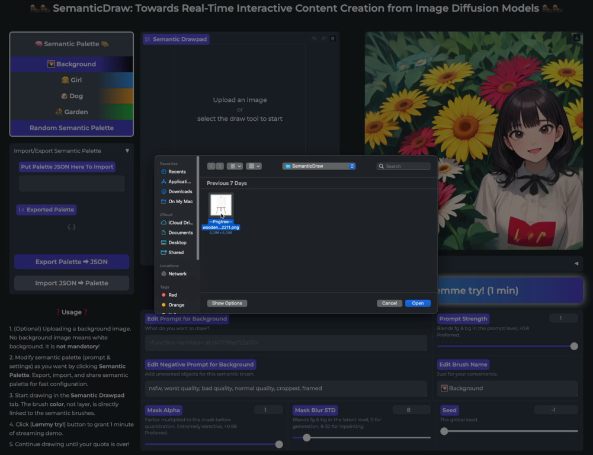
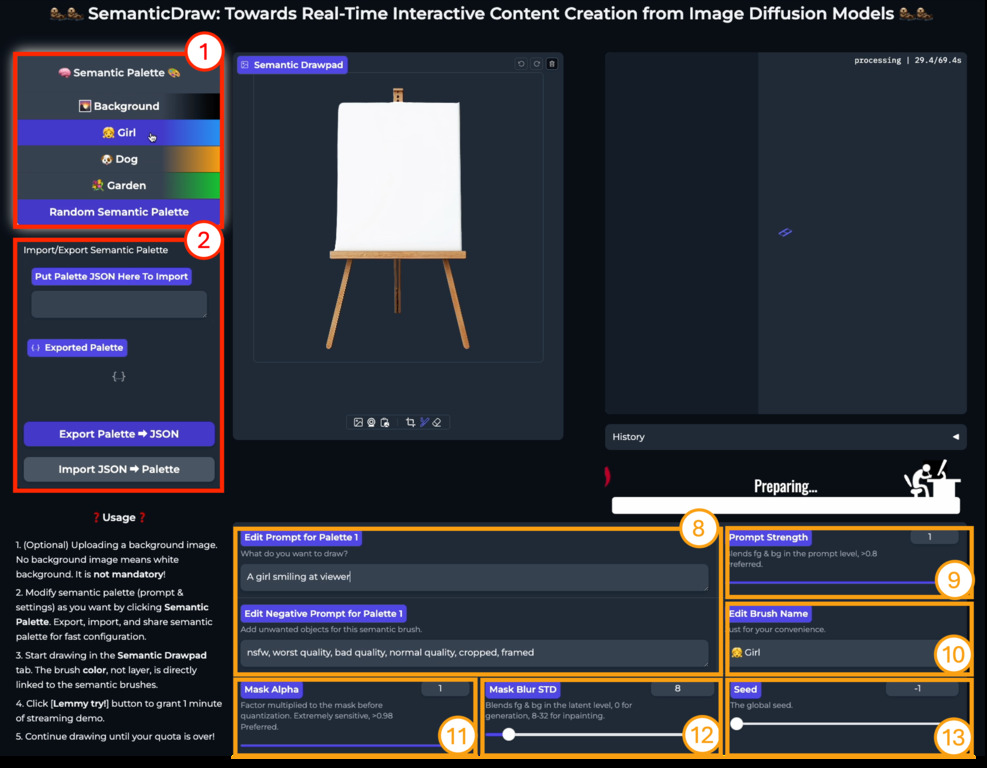
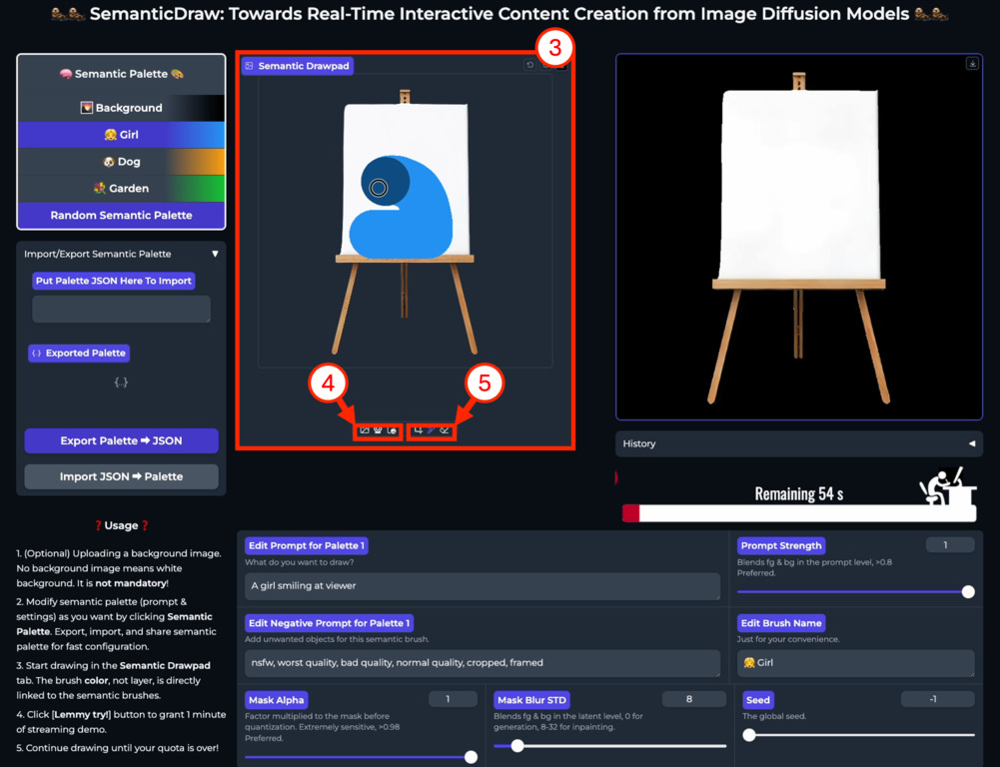
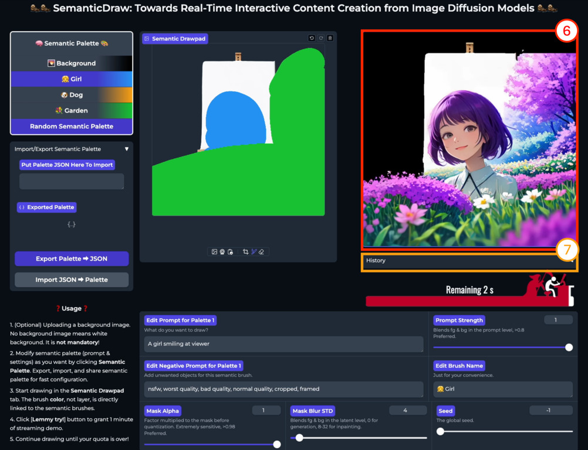
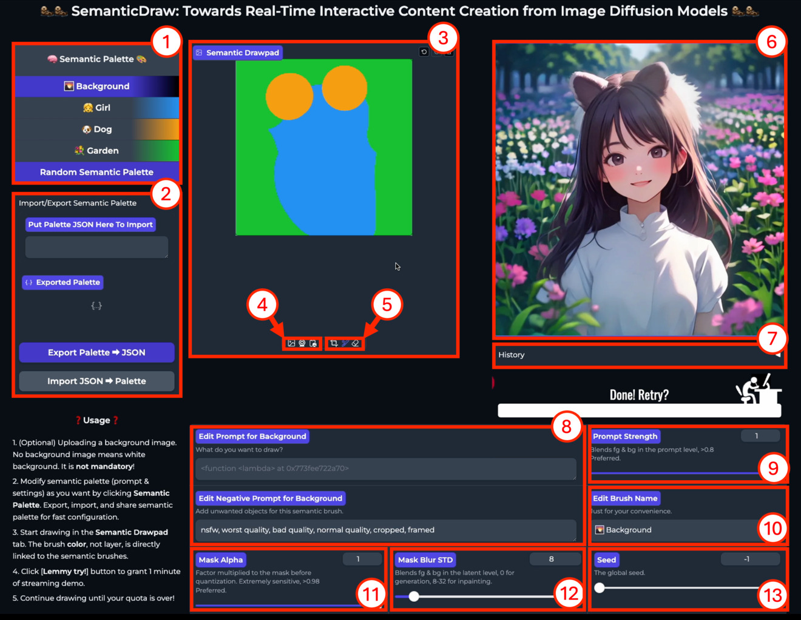

<div align="center">

<h1>SemanticDraw: Towards Real-Time Interactive Content Creation</br>from Image Diffusion Models</h1>

<p align="center">
  
</p>

</div>

tl;dr: SemanticDraw is a *real-time* *interactive* *multiple*-text-to-image generation from user-assigned *regional* text prompts.
In other words, **you can now draw ✍️ using brushes 🖌️ that paints *meanings* 🧠 in addition to *colors*** 🌈!

---

## 🤖 Installation

```bash
conda create -n smd python=3.10 && conda activate smd
pip install -r requirements.txt
```

## ⚡ Usage

### Overview

SemanticDraw is served in serveral different forms.

1. The main GUI demo powered by Gradio is available at `demo/semantic_draw_v2/app.py`. Just type the below line in your command prompt and open `https://localhost:8000` with any web browser will launch the app.

```bash
cd demo/semantic_draw_v2
python app.py --model "your stable diffusion 1.5 checkpoint" --height 512 --width 512 --port 8000
```

2. The large canvas GUI demo (non-streaming) _SemanticDraw_ for _SD1.5_ checkpoints is available at `demo/semantic_palette/app.py`.

```bash
cd demo/semantic_palette
python app.py --model "your stable diffusion 1.5 checkpoint" --port 8000
```

3. The large canvas GUI demo (non-streaming) _SemanticDraw_ for _SDXL_ checkpoints is available at `demo/semantic_palette_sdxl/app.py`.

```bash
cd demo/semantic_palette_sdxl
python app.py --model "your stable diffusion xl checkpoint" --port 8000
```

4. The large canvas GUI demo (non-streaming) _SemanticDraw_ for _SD3_ checkpoints is available at `demo/semantic_palette_sd3/app.py`.

```bash
cd demo/semantic_palette_sd3
python app.py --model "your stable diffusion 3 checkpoint" --port 8000
```

5. Jupyter Lab demos are available in the `notebooks` directory. Simply type `jupyter lab` in the command prompt will open a Jupyter server.

6. As a python library by importing the `model` in `src`. For detailed examples and interfaces, please see the Usage section below.


---

### Demo Application (SemanticDraw)

<p align="center">
  
</p>


#### Features

- Drawing with _semantic palette_ with streaming interface.
- Fully web-based GUI, powered by Gradio.
- Supports any Stable Diffusion v1.5 checkpoint with option `--model`.
- Supports any-sized canvas (if your VRAM permits!) with opetion `--height`, `--width`.
- Supports 8 semantic brushes.

#### Run

```bash
cd src/demo/stream
python app.py [other options]
```

#### Run with `.safetensors`

We now support `.safetensors` type local models.
You can run the demo app with your favorite checkpoint models as follows:
1. Save `<your model>.safetensors` or a [symbolic link](https://mangohost.net/blog/what-is-the-linux-equivalent-to-symbolic-links-in-windows/) to the actual file to `demo/stream/checkpoints`.
2. Run the demo with your model loaded with `python app.py --model <your model>.safetensors`

Done!

#### Other options

- `--model`: Optional. The path to your custom SDv1.5 checkpoint. Both Hugging Face model repository / local safetensor types are supported. e.g., `--model "KBlueLeaf/kohaku-v2.1"` or `--model "realcartoonPixar_v6.safetensors"` Please note that safetensors models should reside in `src/demo/stream/checkpoints`!
- `--height` (`-H`): Optional. Height of the canvas. Default: 768.
- `--width` (`-W`): Optional. Width of the canvas. Default: 1920.
- `--display_col`: Optional. Number of displays in a row. Useful for buffering the old frames. Default: 2.
- `--display_row`: Optional. Number of displays in a column. Useful for buffering the old frames. Default: 2.
- `--bootstrap_steps`: Optional. The number of bootstrapping steps that separate each of the different semantic regions. Best when 1-3. Larger value means better separation, but less harmony within the image. Default: 1.
- `--seed`: Optional. The default seed of the application. Almost never needed since you can modify the seed value in GUI. Default: 2024.
- `--device`: Optional. The number of GPU card (probably 0-7) you want to run the model. Only for multi-GPU servers. Default: 0.
- `--port`: Optional. The front-end port of the application. If the port is 8000, you can access your runtime through `https://localhost:8000` from any web browser. Default: 8000.


#### Instructions

|  |  |
| :----------------------------: | :----------------------------: |
| Upoad a background image | Type some text prompts |
|  |  |
| Draw | Press the play button and enjoy 🤩 |

1. (top-left) **Upload a background image.** You can start with a white background image, as well as any other images from your phone camera or other AI-generated artworks. You can also entirely cover the image editor with specific semantic brush to draw background image simultaneously from the text prompt.

2. (top-right) **Type some text prompts.** Click each semantic brush on the semantic palette on the left of the screen and type in text prompts in the interface below. This will create a new semantic brush for you.

3. (bottom-left) **Draw.** Select appropriate layer (*important*) that matches the order of the semantic palette. That is, ***Layer n*** corresponds to ***Prompt n***. I am not perfectly satisfied with the interface of the drawing interface. Importing professional Javascript-based online drawing tools instead of the default `gr.ImageEditor` will enable more responsive interface. We have released our code with MIT License, so please feel free to fork this repo and build a better user interface upon it. 😁

4. (bottom-right) **Press the play button and enjoy!** The buttons literally mean 'toggle stream/run single/run batch (4)'.


### User Interface (GUI)

<p align="center">
  
</p>

| No. | Component Name | Description |
| --- | -------------- | ----------- |
| 1 | *Semantic palette* | Creates and manages text prompt-mask pairs, a.k.a., _semantic brushes_. |
| 2 | Import/export semantic palette | Easy management of text prompt sets to draw. |
| 3 | Main drawing pad | User draws at each semantic layers with a brush tool. |
| 4 | Background image upload | User uploads background image to start drawing. |
| 5 | Drawing tools | Using brushes and erasers to interactively edit the prompt masks. |
| 6 | Display | Generated images are streamed through this component. |
| 7 | History | Generated images are logged for later reuse. |
| 8 | Prompt edit | User can interactively change the positive/negative prompts at need. |
| 9 | Prompt strength control | Prompt embedding mix ratio between the current & the background. Helps global content blending. Recommended: >0.75 |
| 10 | Brush name edit | Adds convenience by changing the name of the brush. Does not affect the generation. Just for preference. |
| 11 | Mask alpha control | Changes the mask alpha value before quantization. Controls local content blending (simply means that you can use nonbinary masks for fine-grained controls), but extremely sensitive. Recommended: >0.95 |
| 12 | Mask blur std. dev. control | Changes the standard deviation of the quantized mask of the current semantic brush. Less sensitive than mask alpha control. |
| 13 | Seed control | Changes the seed of the application. May not be needed, since we generate infinite stream of images. |

### Demo Application Architecture

There are two types of transaction data between the front-end and the back-end (`model.semantic_draw.SemanticDraw`) of the application: a (1) background image object and a (2) list of text prompt-mask pairs.
We choose to call a pair of the latter as a _semantic brush_.
Despite its fancy name, a _semantic brush_ is just a pair of a text prompt and a regional mask assigned to the prompt, possibly with additional mask-controlling parameters.
Users interact with the application by registering and updating these two types of data to control the image generation stream.
The interface is summarized in the image below ⬇️:

<p align="center">
  
</p>

---

### Demo Application (SemanticDraw)

<div>

<p align="center">
  
</p>

</div>


#### Features

- Fully web-based GUI, powered by Gradio.
- Supports any Stable Diffusion v1.5 checkpoint with option `--model`.
- Supports any-sized canvas (if your VRAM permits!) with opetion `--height`, `--width`.
- Supports 5 semantic brushes. If you want more brushes, you can use our python interface directly. Please see our Jupyter notebook references in the `notebooks` directory.

#### Run

```bash
cd src/demo/semantic_palette
python app.py [other options]
```

#### Run with `.safetensors`

We now support `.safetensors` type local models.
You can run the demo app with your favorite checkpoint models as follows:
1. Save `<your model>.safetensors` or a [symbolic link](https://mangohost.net/blog/what-is-the-linux-equivalent-to-symbolic-links-in-windows/) to the actual file to `demo/semantic_palette/checkpoints`.
2. Run the demo with your model loaded with `python app.py --model <your model>.safetensors`

Done!

#### Other options

- `--model`: Optional. The path to your custom SDv1.5 checkpoint. Both Hugging Face model repository / local safetensor types are supported. e.g., `--model "KBlueLeaf/kohaku-v2.1"` or `--model "realcartoonPixar_v6.safetensors"` Please note that safetensors models should reside in `src/demo/semantic_palette/checkpoints`!
- `--height` (`-H`): Optional. Height of the canvas. Default: 768.
- `--width` (`-W`): Optional. Width of the canvas. Default: 1920.
- `--bootstrap_steps`: Optional. The number of bootstrapping steps that separate each of the different semantic regions. Best when 1-3. Larger value means better separation, but less harmony within the image. Default: 1.
- `--seed`: Optional. The default seed of the application. Almost never needed since you can modify the seed value in GUI. Default: -1 (random).
- `--device`: Optional. The number of GPU card (probably 0-7) you want to run the model. Only for multi-GPU servers. Default: 0.
- `--port`: Optional. The front-end port of the application. If the port is 8000, you can access your runtime through `https://localhost:8000` from any web browser. Default: 8000.

---

### Basic Usage (Python)

The main python modules in our project is two-fold: (1) `model.SemanticDrawPipeline` for single-call generation (might be more preferable for CLI users), and (2) `model.SemanticDraw` for streaming application such as the one in the main figure of this README page.
We provide minimal examples for the possible applications below.


### Streaming Generation Process

With *multi-prompt stream batch*, our modification to the [original stream batch architecture](https://github.com/cumulo-autumn/StreamDiffusion) by [@cumulo_autumn](https://twitter.com/cumulo_autumn), we can stream this multi-prompt text-to-image generation process to generate images for ever.

**Result:**

|  |  |
| :----------------------------: | :----------------------------: |
| Semantic Brush Input | Generated Stream |

**Code:**

```python
import torch
from util import seed_everything, Streamer
from model import SemanticDraw

# The following packages are imported only for loading the images.
import torchvision.transforms as T
import requests
import time
import imageio # This is not included in our requirements.txt!
from functools import reduce
from io import BytesIO
from PIL import Image


seed = 2024
device = 0
height = 768
width = 512

# Load the module.
device = torch.device(f'cuda:{device}')
smd = SemanticDraw(
    device,
    hf_key='ironjr/BlazingDriveV11m',
    height=height,
    width=width,
    cfg_type='none',
    autoflush=True,
    use_tiny_vae=True,
    mask_type='continuous',
    bootstrap_steps=2,
    bootstrap_mix_steps=1.5,
    seed=seed,
)

# Load the masks.
masks = []
for i in range(1, 3):
    url = f'./assets/zeus/prompt_p{i}.png'
    response = requests.get(url)
    mask = Image.open(BytesIO(response.content)).convert('RGBA')
    mask = (T.ToTensor()(mask)[-1:] > 0.5).float()
    masks.append(mask)
# In this example, background is simply set as non-marked regions.
background = reduce(torch.logical_and, [m == 0 for m in masks])

# Register a background, prompts, and masks (this can be called multiple times).
smd.update_background(Image.new(size=(width, height), mode='RGB', color=(255, 255, 255)))
smd.update_single_layer(
    idx=0,
    prompt='a photo of Mount Olympus',
    negative_prompt='worst quality, bad quality, normal quality, cropped, framed',
    mask=background,
    mask_strength=1.0,
    mask_std=0.0,
    prompt_strength=1.0,
)
smd.update_single_layer(
    idx=1,
    prompt='1girl, looking at viewer, lifts arm, smile, happy, Greek goddess Athena',
    negative_prompt='worst quality, bad quality, normal quality, cropped, framed',
    mask=masks[0],
    mask_strength=1.0,
    mask_std=0.0,
    prompt_strength=1.0,
)
smd.update_single_layer(
    idx=2,
    prompt='a small, sitting owl',
    negative_prompt='worst quality, bad quality, normal quality, cropped, framed',
    mask=masks[1],
    mask_strength=1.0,
    mask_std=0.0,
    prompt_strength=1.0,
)


# Generate images... forever.
# while True:
#     image = smd()
#     image.save(f'{str(int(time.time() % 100000))}.png') # This will take up your hard drive pretty much soon.
#     display(image) # If `from IPython.display import display` is called.
#
#     You can also intercept the process in the middle of the generation by updating other background, prompts or masks.
#     smd.update_single_layer(
#         idx=2,
#         prompt='a small, sitting owl',
#         negative_prompt='worst quality, bad quality, normal quality, cropped, framed',
#         mask=masks[1],
#         mask_strength=1.0,
#         mask_std=0.0,
#         prompt_strength=1.0,
#     )

# Or make a video/gif from your generation stream (requires `imageio`)
frames = []
for _ in range(50):
    image = smd()
    frames.append(image)
imageio.mimsave('my_beautiful_creation.gif', frames, loop=0)
```

---

### Region-Based Multi-Text-to-Image Generation

We support arbitrary-sized image generation from arbitrary number of prompt-mask pairs.
The first example is a simple example of generation 
Notice that **our generation results also obeys strict prompt separation**.


**Result:**

|  |  |
| :----------------------------: | :----------------------------: |
| Semantic Brush Input | Generated Image (10 sec) |

<p align="center">
    No more unwanted prompt mixing! Brown boy and pink girl generated simultaneously without a problem.
</p>

**Code:**

```python
import torch
from model import SemanticDrawPipeline
from util import seed_everything

# The following packages are imported only for loading the images.
import torchvision.transforms as T
import requests
from functools import reduce
from io import BytesIO
from PIL import Image


seed = 2024
device = 0

# Load the module.
seed_everything(seed)
device = torch.device(f'cuda:{device}')
smd = SemanticDrawPipeline(
    device,
    hf_key='ironjr/BlazingDriveV11m',
)

# Load prompts.
prompts = [
    # Background prompt.
    '1girl, 1boy, times square',
    # Foreground prompts.
    '1boy, looking at viewer, brown hair, casual shirt',
    '1girl, looking at viewer, pink hair, leather jacket',
]
negative_prompts = [
    '',
    '1girl', # (Optional) The first prompt is a boy so we don't want a girl.
    '1boy', # (Optional) The first prompt is a girl so we don't want a boy.
]
negative_prompt_prefix = 'worst quality, bad quality, normal quality, cropped, framed'
negative_prompts = [negative_prompt_prefix + ', ' + p for p in negative_prompts]

# Load masks.
masks = []
for i in range(1, 3):
    url = f'./assets/timessquare/timessquare_{i}.png'
    response = requests.get(url)
    mask = Image.open(BytesIO(response.content)).convert('RGBA')
    mask = (T.ToTensor()(mask)[-1:] > 0.5).float()
    masks.append(mask)
# In this example, background is simply set as non-marked regions.
background = reduce(torch.logical_and, [m == 0 for m in masks])
masks = torch.stack([background] + masks, dim=0).float()

height, width = masks.shape[-2:] # (768, 768) in this example.

# Sample an image.
image = smd(
    prompts,
    negative_prompts,
    masks=masks,
    mask_strengths=1,
    mask_stds=0,
    height=height,
    width=width,
    bootstrap_steps=2,
)
image.save('my_beautiful_creation.png')
```

---

### (🔥NEW!!!) Region-Based Multi-Text-to-Image Generation with Stable Diffusion 3

We support arbitrary-sized image generation from arbitrary number of prompt-mask pairs using custom SDXL models.
This is powered by [SDXL-Lightning LoRA](https://huggingface.co/ByteDance/SDXL-Lightning) and our stabilization trick for MultiDiffusion in conjunction with Lightning-type sampling algorithm.

**Result:**

|  |  |
| :----------------------------: | :----------------------------: |
| Semantic Brush Input | Generated Image (**6.3 sec!**) |

<p align="center">
    1024x1024 image generated with <a href="https://huggingface.co/stabilityai/stable-diffusion-3-medium">Stable Diffusion 3</a> accelerated by <a href="https://huggingface.co/jasperai/flash-sd3">Flash Diffusion</a>.
</p>

**Code:**

```python
import torch
from model import SemanticDraw3Pipeline
from util import seed_everything
from prompt_util import print_prompts, preprocess_prompts

# The following packages are imported only for loading the images.
import torchvision.transforms as T
import requests
from functools import reduce
from io import BytesIO
from PIL import Image


seed = 1
device = 0

# Load the module.
seed_everything(seed)
device = torch.device(f'cuda:{device}')
smd = SemanticDrawSDXLPipeline(
    device,
    hf_key='cagliostrolab/animagine-xl-3.1',
    has_i2t=False,
)

# Load prompts.
prompts = [
    # Background prompt.
    'blue sky with large words "Stream" on it',
    # Foreground prompts.
    'a photo of the dolomites, masterpiece, absurd quality, background, no humans',
    'a photo of Gandalf the Gray staring at the viewer',
]
negative_prompts = [
    '1girl, 1boy, humans, humans, humans',
    '1girl, 1boy, humans, humans, humans',
    '',
]
negative_prompt_prefix = 'worst quality, bad quality, normal quality, cropped, framed'
negative_prompts = [negative_prompt_prefix + ', ' + p for p in negative_prompts]

# Preprocess prompts for better results.
prompts, negative_prompts = preprocess_prompts(
    prompts,
    negative_prompts,
    style_name='(None)',
    quality_name='Standard v3.1',
)

# Load masks.
masks = []
for i in range(1, 3):
    url = f'./assets/fantasy_large/fantasy_large_{i}.png'
    response = requests.get(url)
    mask = Image.open(BytesIO(response.content)).convert('RGBA')
    mask = (T.ToTensor()(mask)[-1:] > 0.5).float()
    masks.append(mask)
# In this example, background is simply set as non-marked regions.
background = reduce(torch.logical_and, [m == 0 for m in masks])
masks = torch.stack([background] + masks, dim=0).float()

height, width = masks.shape[-2:] # (1024, 1024) in this example.

# Sample an image.
image = smd(
    prompts,
    negative_prompts,
    masks=masks,
    mask_strengths=1,
    mask_stds=0,
    height=height,
    width=width,
    bootstrap_steps=2,
    guidance_scale=0,
)
image.save('my_beautiful_creation.png')
```

---

### Region-Based Multi-Text-to-Image Generation with Custom SDXL

We support arbitrary-sized image generation from arbitrary number of prompt-mask pairs using custom SDXL models.
This is powered by [SDXL-Lightning LoRA](https://huggingface.co/ByteDance/SDXL-Lightning) and our stabilization trick in conjunction with Lightning-type sampling algorithm.

**Result:**

|  |  |
| :----------------------------: | :----------------------------: |
| Semantic Brush Input | Generated Image (12 sec) |

<p align="center">
    1024x1024 image generated with <a href="https://huggingface.co/ByteDance/SDXL-Lightning">SDXL-Lightning LoRA</a> and <a href="https://huggingface.co/cagliostrolab/animagine-xl-3.1">Animagine XL 3.1</a> checkpoint.
</p>

**Code:**

```python
import torch
from model import SemanticDrawSDXLPipeline
from util import seed_everything
from prompt_util import print_prompts, preprocess_prompts

# The following packages are imported only for loading the images.
import torchvision.transforms as T
import requests
from functools import reduce
from io import BytesIO
from PIL import Image


seed = 0
device = 0

# Load the module.
seed_everything(seed)
device = torch.device(f'cuda:{device}')
smd = SemanticDrawSDXLPipeline(
    device,
    hf_key='cagliostrolab/animagine-xl-3.1',
    has_i2t=False,
)

# Load prompts.
prompts = [
    # Background prompt.
    'purple sky, planets, planets, planets, stars, stars, stars',
    # Foreground prompts.
    'a photo of the dolomites, masterpiece, absurd quality, background, no humans',
    '1girl, looking at viewer, pretty face, blue hair, fantasy style, witch, magi, robe',
]
negative_prompts = [
    '1girl, 1boy, humans, humans, humans',
    '1girl, 1boy, humans, humans, humans',
    '',
]
negative_prompt_prefix = 'worst quality, bad quality, normal quality, cropped, framed'
negative_prompts = [negative_prompt_prefix + ', ' + p for p in negative_prompts]

# Preprocess prompts for better results.
prompts, negative_prompts = preprocess_prompts(
    prompts,
    negative_prompts,
    style_name='(None)',
    quality_name='Standard v3.1',
)

# Load masks.
masks = []
for i in range(1, 3):
    url = f'./assets/fantasy_large/fantasy_large_{i}.png'
    response = requests.get(url)
    mask = Image.open(BytesIO(response.content)).convert('RGBA')
    mask = (T.ToTensor()(mask)[-1:] > 0.5).float()
    masks.append(mask)
# In this example, background is simply set as non-marked regions.
background = reduce(torch.logical_and, [m == 0 for m in masks])
masks = torch.stack([background] + masks, dim=0).float()

height, width = masks.shape[-2:] # (1024, 1024) in this example.

# Sample an image.
image = smd(
    prompts,
    negative_prompts,
    masks=masks,
    mask_strengths=1,
    mask_stds=0,
    height=height,
    width=width,
    bootstrap_steps=2,
    guidance_scale=0,
)
image.save('my_beautiful_creation.png')
```

---

### *Larger* Region-Based Multi-Text-to-Image Generation

The original MultiDiffusion pipeline using 50 step DDIM sampler takes roughly an hour to run the code, but we have reduced in down to **a minute**.

**Result:**

|  |
| :----------------------------: |
| Semantic Brush Input |
|   |
| Generated Image (59 sec) |

**Code:**

```python
import torch
from model import SemanticDrawPipeline
from util import seed_everything

# The following packages are imported only for loading the images.
import torchvision.transforms as T
import requests
from functools import reduce
from io import BytesIO
from PIL import Image


seed = 2024
device = 0

# Load the module.
seed_everything(seed)
device = torch.device(f'cuda:{device}')
smd = SemanticDrawPipeline(device)

# Load prompts.
prompts = [
    # Background prompt.
    'clear deep blue sky',
    # Foreground prompts.
    'summer mountains',
    'the sun',
    'the moon',
    'a giant waterfall',
    'a giant waterfall',
    'clean deep blue lake',
    'a large tree',
    'a large tree',
]
negative_prompts = ['worst quality, bad quality, normal quality, cropped, framed'] * len(prompts)

# Load masks.
masks = []
for i in range(1, 9):
    url = f'./assets/irworobongdo/irworobongdo_{i}.png'
    response = requests.get(url)
    mask = Image.open(BytesIO(response.content)).convert('RGBA')
    mask = (T.ToTensor()(mask)[-1:] > 0.5).float()
    masks.append(mask)
# In this example, background is simply set as non-marked regions.
background = reduce(torch.logical_and, [m == 0 for m in masks])
masks = torch.stack([background] + masks, dim=0).float()

height, width = masks.shape[-2:] # (768, 1920) in this example.

# Sample an image.
image = smd(
    prompts,
    negative_prompts,
    masks=masks,
    mask_strengths=1,
    mask_stds=0,
    height=height,
    width=width,
    bootstrap_steps=2,
)
image.save('my_beautiful_creation.png')
```

---

### Image Inpainting with Prompt Separation

Our pipeline also enables editing and inpainting existing images.
We also support *any* SD 1.5 checkpoint models.
One exceptional advantage of ours is that we provide an easy separation of prompt
You can additionally trade-off between prompt separation and overall harmonization by changing the argument `bootstrap_steps` from 0 (full mixing) to 5 (full separation).
We recommend `1-3`.
The following code is a minimal example of performing prompt separated multi-prompt image inpainting using our pipeline on a custom model.

**Result:**

|  |  |  |
| :----------------------------: | :----------------------------: | :----------------------------: |
| Images to Inpaint | Semantic Brush Input | Inpainted Image (9 sec) |

**Code:**

```python
import torch
from model import SemanticDrawPipeline
from util import seed_everything

# The following packages are imported only for loading the images.
import torchvision.transforms as T
import requests
from io import BytesIO
from PIL import Image


seed = 2
device = 0

# Load the module.
seed_everything(seed)
device = torch.device(f'cuda:{device}')
smd = SemanticDrawPipeline(
    device,
    hf_key='ironjr/BlazingDriveV11m',
)

# Load the background image you want to start drawing.
#   Although it works for any image, we recommend to use background that is generated
#   or at least modified by the same checkpoint model (e.g., preparing it by passing
#   it to the same checkpoint for an image-to-image pipeline with denoising_strength 0.2)
#   for the maximally harmonized results!
#   However, in this example, we choose to use a real-world image for the demo.
url = f'./assets/timessquare/timessquare.jpeg'
response = requests.get(url)
background_image = Image.open(BytesIO(response.content)).convert('RGB')

# Load prompts and background prompts (explicitly).
background_prompt = '1girl, 1boy, times square'
prompts = [
    # Foreground prompts.
    '1boy, looking at viewer, brown hair, casual shirt',
    '1girl, looking at viewer, pink hair, leather jacket',
]
negative_prompts = [
    '1girl',
    '1boy',
]
negative_prompt_prefix = 'worst quality, bad quality, normal quality, cropped, framed'
negative_prompts = [negative_prompt_prefix + ', ' + p for p in negative_prompts]
background_negative_prompt = negative_prompt_prefix

# Load masks.
masks = []
for i in range(1, 3):
    url = f'./assets/timessquare/timessquare_{i}.png'
    response = requests.get(url)
    mask = Image.open(BytesIO(response.content)).convert('RGBA')
    mask = (T.ToTensor()(mask)[-1:] > 0.5).float()
    masks.append(mask)
masks = torch.stack(masks, dim=0).float()
height, width = masks.shape[-2:] # (768, 768) in this example.

# Sample an image.
image = smd(
    prompts,
    negative_prompts,
    masks=masks,
    mask_strengths=1,
    # Use larger standard deviation to harmonize the inpainting result (Recommended: 8-32)!
    mask_stds=16.0,
    height=height,
    width=width,
    bootstrap_steps=2,
    bootstrap_leak_sensitivity=0.1,
    # This is for providing the image input.
    background=background_image,
    background_prompt=background_prompt,
    background_negative_prompt=background_negative_prompt,
)
image.save('my_beautiful_inpainting.png')
```

---

### Panorama Generation

Our [`model.SemanticDrawPipeline`](./src/model/pipeline_semantic_draw.py) supports x10 faster generation of irregularly large size images such as panoramas.
For example, the following code runs in 10s with a single 2080 Ti GPU.

**Result:**

<p align="center">
  
</p>
<p align="center">
    512x3072 image generated in 10 seconds.
</p>

**Code:**

```python
import torch
from model import SemanticDrawPipeline

device = 0

# Load the module.
device = torch.device(f'cuda:{device}')
smd = SemanticDrawPipeline(device)

# Sample a panorama image.
smd.sample_panorama('A photo of Alps', height=512, width=3072)
image.save('my_panorama_creation.png')
```

---

### Basic StableDiffusion

We also support standard single-prompt single-tile sampling of StableDiffusion checkpoint for completeness.
This behaves exactly the same as calling [`diffuser`](https://huggingface.co/docs/diffusers/en/index)'s [`StableDiffusionPipeline`](https://github.com/huggingface/diffusers/blob/main/src/diffusers/pipelines/stable_diffusion/pipeline_stable_diffusion.py).

**Result:**

<p align="left">
  
</p>

**Code:**

```python
import torch
from model import SemanticDrawPipeline

device = 0

# Load the module.
device = torch.device(f'cuda:{device}')
smd = SemanticDrawPipeline(device)

# Sample an image.
image = smd.sample('A photo of the dolomites')
image.save('my_creation.png')
```

